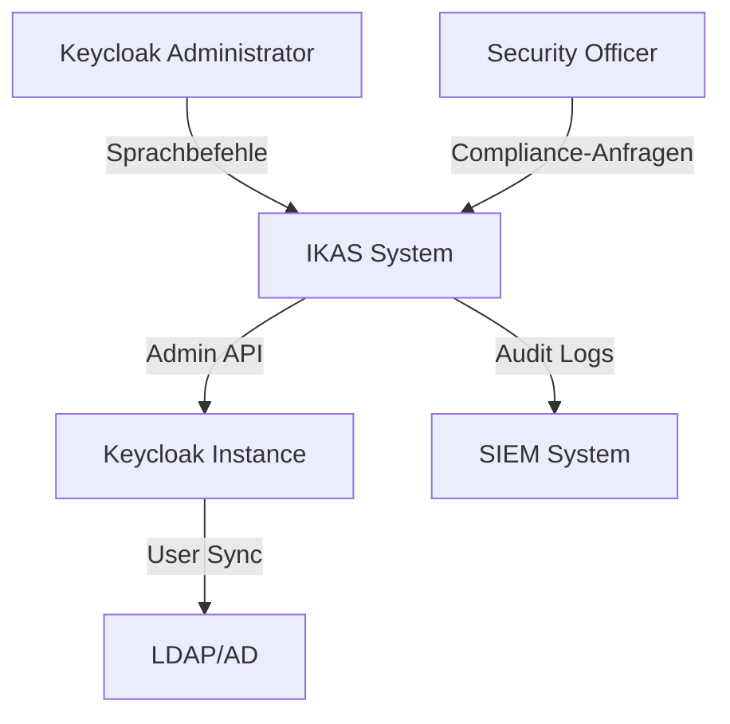
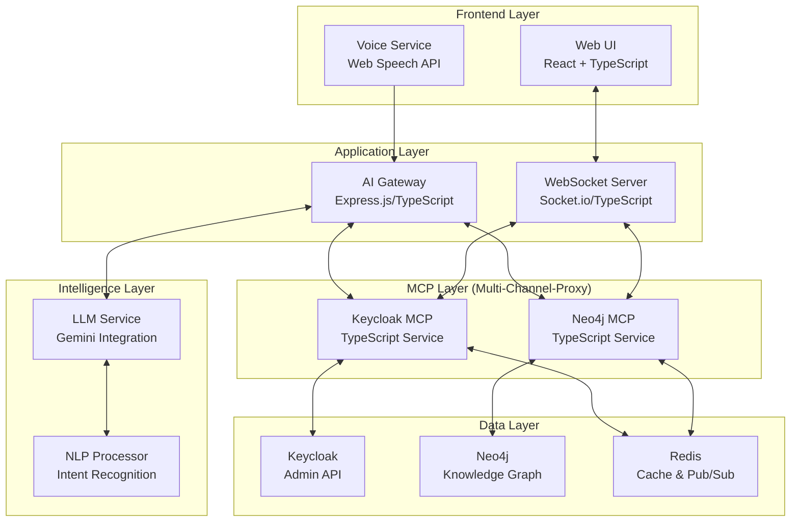
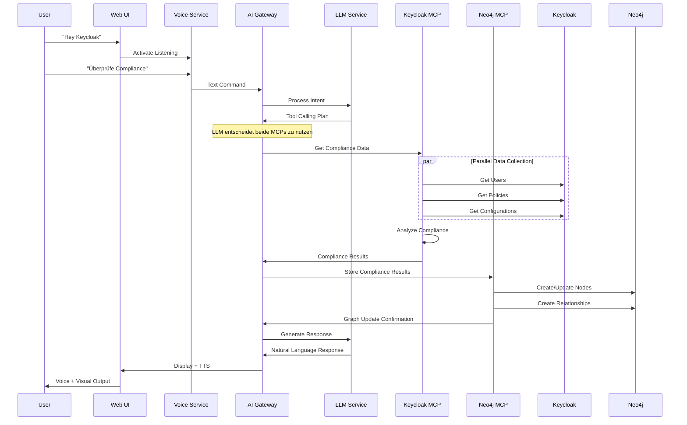
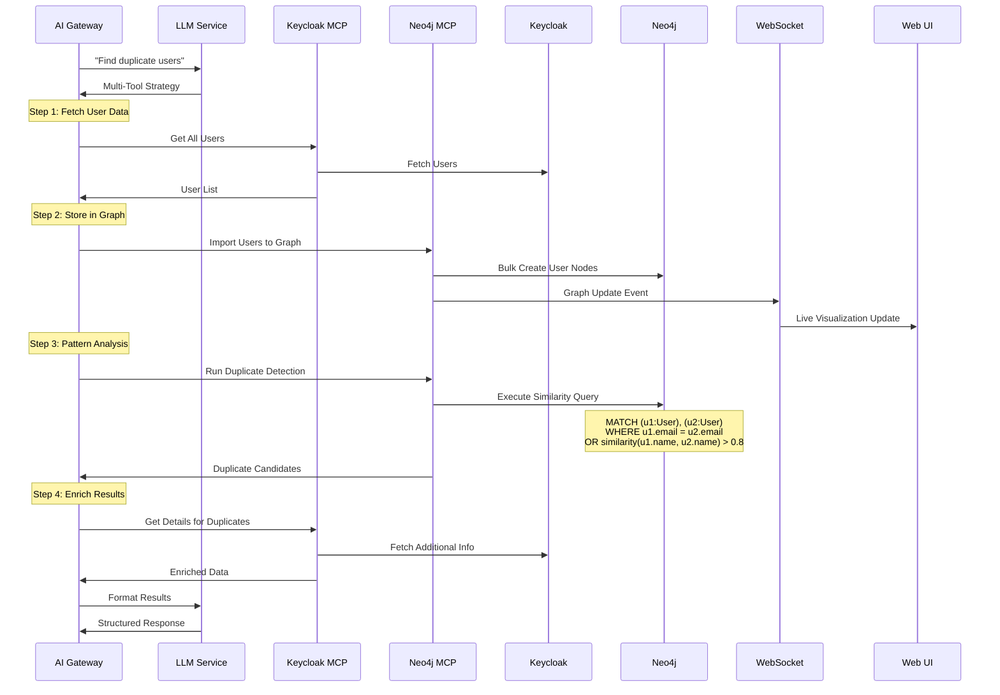

# arc42 Architekturdokumentation
## Intelligentes Keycloak Admin System (IKAS)

**Version:** 1.0  
**Status:** Konzept  
**Datum:** August 2025  
**Autoren:** Entwicklungsteam IKAS

---

## 1. Einführung und Ziele

### 1.1 Aufgabenstellung

Das Intelligente Keycloak Admin System (IKAS) revolutioniert die Verwaltung von Keycloak-Instanzen durch die Integration von:
- Natürlicher Sprachverarbeitung für intuitive Administratorinteraktion
- KI-gestützter Analyse und Entscheidungsfindung via MCP Protocol
- Knowledge Graph für komplexe Beziehungsanalysen
- Automatisierte Compliance- und Sicherheitsüberprüfungen
- **NEU:** Integration existierender MCP Services (Keycloak MCP, Neo4j MCP)

### 1.2 Qualitätsziele

| Priorität | Qualitätsziel | Szenario |
|-----------|---------------|----------|
| 1 | **Benutzerfreundlichkeit** | Administrator kann ohne Schulung per Sprachbefehl Keycloak verwalten |
| 1 | **Sicherheit** | Alle Operationen sind authentifiziert und autorisiert |
| 2 | **Performance** | Antwortzeit < 3 Sekunden für Standard-Abfragen |
| 2 | **Zuverlässigkeit** | 99.9% Verfügbarkeit während Geschäftszeiten |
| 3 | **Erweiterbarkeit** | Neue Compliance-Regeln in < 1 Tag integrierbar |

### 1.3 Stakeholder

| Rolle | Kontakt | Erwartungen |
|-------|---------|-------------|
| Keycloak-Administratoren | Ops-Team | Vereinfachte, schnelle Verwaltung |
| Security Officer | CISO | Compliance-Nachweise, Sicherheitsanalysen |
| Entwicklungsteam | Dev-Team | Klare APIs, modulare Architektur |
| Management | CTO | ROI durch Zeitersparnis, Fehlerreduktion |

---

## 2. Randbedingungen

### 2.1 Technische Randbedingungen

| Randbedingung | Erläuterung |
|---------------|-------------|
| **TC1** Browser-Kompatibilität | Chrome 90+, Firefox 88+, Safari 14+ (Web Speech API) |
| **TC2** Keycloak-Version | Keycloak 20.0+ mit Admin API |
| **TC3** Neo4j | Version 5.0+ für Knowledge Graph |
| **TC4** Netzwerk | HTTPS für alle Verbindungen |
| **TC5** Deutsche Sprache | Primäre Sprache für Sprachinteraktion |
| **TC6** MCP Protocol | Standardisiertes Model Context Protocol für Tool-Integration |
| **TC7** Existierende MCPs | Keycloak MCP (vorhanden), neo4j-contrib/mcp-neo4j-cypher |

### 2.2 Organisatorische Randbedingungen

| Randbedingung | Erläuterung |
|---------------|-------------|
| **OC1** Team | 2-3 Entwickler (reduziert durch MCP-Nutzung) |
| **OC2** Budget | 150.000 EUR für Phase 1 (reduziert) |
| **OC3** Zeitrahmen | MVP in 3 Monaten (beschleunigt) |
| **OC4** Demo Amsterdam | Live-Präsentation auf IAM-Konferenz (Deadline fest) |

### 2.3 Konventionen

| Konvention | Beschreibung |
|------------|-------------|
| **CV1** Architektur | Microservices-Ansatz mit REST APIs |
| **CV2** Dokumentation | arc42 für Architektur, OpenAPI für APIs |
| **CV3** Code-Style | ESLint + Prettier für TypeScript |
| **CV4** Versionierung | Semantic Versioning, Git Flow |

---

## 3. Kontextabgrenzung

### 3.1 Fachlicher Kontext



### 3.2 Technischer Kontext

| Schnittstelle | Technologie | Format | Beschreibung |
|---------------|------------|--------|--------------|
| Spracheingabe | Web Speech API | Audio → Text | Browser-native Spracherkennung |
| LLM Integration | Google Gemini API | REST/JSON | KI-Verarbeitung |
| Keycloak Admin | Keycloak Admin Client | REST/JSON | Verwaltungsoperationen |
| Knowledge Graph | Neo4j Bolt Protocol | Cypher | Graphdatenbank-Zugriff |
| Frontend ↔ Backend | WebSocket + REST | JSON | Bidirektionale Kommunikation |

---

## 4. Lösungsstrategie

### 4.1 Technologieentscheidungen

| Aspekt | Lösung | Begründung |
|--------|--------|------------|
| **Frontend** | Next.js + TypeScript | Full-Stack Framework, SSR-Support, Type-Safety |
| **Spracherkennung** | Web Speech API + Fallback | Native Browser-Unterstützung, keine Kosten |
| **KI/LLM** | Google Gemini | Deutsch-Support, Function Calling, @google/generative-ai |
| **Backend** | Express.js (TypeScript) | Async-Support, einheitliche Sprache, große Community |
| **MCP Implementation** | TypeScript mit Zod | Type-Validation, @modelcontextprotocol/sdk |
| **Graph Database** | Neo4j | Beste Graph-Traversal-Performance, Neo4j JavaScript Driver |
| **Message Queue** | Redis Pub/Sub | Einfachheit, Performance für Event-Streaming, ioredis |

### 4.2 Architekturansätze

1. **Event-Driven Architecture**: Lose Kopplung zwischen Komponenten
2. **CQRS Pattern**: Trennung von Lese- und Schreiboperationen
3. **Repository Pattern**: Abstraktion der Datenzugriffe
4. **Chain of Responsibility**: Für LLM Tool-Calling
5. **Circuit Breaker**: Fehlertoleranz bei externen Services

---

## 5. Bausteinsicht

### 5.1 Ebene 1: Gesamtsystem



### 5.2 Ebene 2: MCP Services Detail

#### 5.2.1 Keycloak MCP Service

```typescript
// keycloak-mcp-server/
├── src/
│   ├── api/
│   │   ├── endpoints/
│   │   │   ├── users.ts         // Benutzerverwaltung
│   │   │   ├── roles.ts         // Rollenverwaltung
│   │   │   ├── groups.ts        // Gruppenverwaltung
│   │   │   ├── clients.ts       // Client-Konfiguration
│   │   │   └── realms.ts        // Realm-Operationen
│   │   └── middleware/
│   │       ├── auth.ts
│   │       ├── rate-limiting.ts
│   │       └── logging.ts
│   ├── core/
│   ├── config.py
│   ├── keycloak_client.py  # Keycloak Admin Client Wrapper
│   └── exceptions.py
├── services/
│   ├── user_service.py
│   ├── compliance_service.py
│   ├── security_scanner.py
│   └── cache_service.py
├── models/
│   ├── keycloak_models.py
│   ├── requests.py
│   └── responses.py
└── utils/
    ├── validators.py
    └── transformers.py
```

#### 5.2.2 Neo4j MCP Service

```python
# neo4j_mcp_service/
├── api/
│   ├── endpoints/
│   │   ├── graph_write.py   # Schreiboperationen
│   │   ├── graph_query.py   # Leseoperationen
│   │   ├── analytics.py     # Analysen & Reports
│   │   └── patterns.py      # Mustererkennung
│   └── middleware/
│       ├── auth.py
│       └── logging.py
├── core/
│   ├── config.py
│   ├── neo4j_client.py     # Neo4j Driver Wrapper
│   └── exceptions.py
├── services/
│   ├── graph_service.py
│   ├── pattern_service.py   # Duplikate, Anomalien
│   ├── compliance_graph.py  # Compliance-Visualisierung
│   └── relationship_service.py
├── models/
│   ├── graph_models.py
│   ├── cypher_queries.py
│   └── responses.py
└── utils/
    ├── cypher_builder.py
    └── graph_transformer.py
```

### 5.3 Wichtige Schnittstellen

```typescript
// Tool-Calling Interface für LLM
interface ToolCall {
  service: 'keycloak_mcp' | 'neo4j_mcp';
  action: string;
  parameters: Record<string, any>;
  context?: {
    realm?: string;
    userId?: string;
    sessionId: string;
  };
}

// Keycloak MCP Interface
interface KeycloakMCPRequest {
  operation: 'read' | 'write' | 'analyze';
  resource: 'users' | 'roles' | 'groups' | 'clients' | 'realms';
  action: string;
  filters?: Record<string, any>;
  data?: any;
}

// Neo4j MCP Interface  
interface Neo4jMCPRequest {
  operation: 'query' | 'mutate' | 'analyze';
  queryType?: 'cypher' | 'pattern' | 'traversal';
  query?: string;
  parameters?: Record<string, any>;
  visualization?: boolean;
}

// Unified Response Interface
interface MCPResponse {
  service: 'keycloak_mcp' | 'neo4j_mcp';
  success: boolean;
  data?: any;
  error?: string;
  metadata?: {
    duration: number;
    affectedNodes?: number;
    cacheHit?: boolean;
  };
}
```

---

## 6. Laufzeitsicht

### 6.1 Szenario: Compliance-Prüfung per Sprachbefehl



### 6.2 Szenario: Cross-Service Analyse (Duplikat-Erkennung)



---

## 7. Verteilungssicht

### 7.1 Entwicklungsumgebung

```yaml
# docker-compose.dev.yml
version: '3.8'
services:
  frontend:
    build: ./frontend
    ports: ["3000:3000"]
    environment:
      - REACT_APP_API_URL=http://localhost:8000
  
  api-gateway:
    build: ./api-gateway
    ports: ["8000:8000"]
    environment:
      - GEMINI_API_KEY=${GEMINI_API_KEY}
      - KEYCLOAK_MCP_URL=http://keycloak-mcp:8001
      - NEO4J_MCP_URL=http://neo4j-mcp:8002
    depends_on:
      - keycloak-mcp
      - neo4j-mcp
  
  keycloak-mcp:
    build: ./keycloak-mcp-service
    ports: ["8001:8001"]
    environment:
      - SERVICE_NAME=keycloak-mcp
      - KEYCLOAK_URL=http://keycloak:8080
      - KEYCLOAK_REALM=master
      - KEYCLOAK_CLIENT_ID=admin-cli
      - KEYCLOAK_CLIENT_SECRET=${KEYCLOAK_SECRET}
      - REDIS_URL=redis://redis:6379
    depends_on:
      - keycloak
      - redis
  
  neo4j-mcp:
    build: ./neo4j-mcp-service
    ports: ["8002:8002"]
    environment:
      - SERVICE_NAME=neo4j-mcp
      - NEO4J_URI=bolt://neo4j:7687
      - NEO4J_USER=neo4j
      - NEO4J_PASSWORD=${NEO4J_PASSWORD}
      - REDIS_URL=redis://redis:6379
    depends_on:
      - neo4j
      - redis
  
  keycloak:
    image: quay.io/keycloak/keycloak:24.0
    ports: ["8080:8080"]
    environment:
      - KEYCLOAK_ADMIN=admin
      - KEYCLOAK_ADMIN_PASSWORD=admin
    command: start-dev
  
  neo4j:
    image: neo4j:5.15
    ports: 
      - "7474:7474"  # Browser
      - "7687:7687"  # Bolt
    environment:
      - NEO4J_AUTH=neo4j/password
      - NEO4J_PLUGINS=["apoc", "graph-data-science"]
  
  redis:
    image: redis:7.2-alpine
    ports: ["6379:6379"]
    command: redis-server --appendonly yes
  
  websocket-server:
    build: ./websocket-server
    ports: ["3001:3001"]
    environment:
      - REDIS_URL=redis://redis:6379
    depends_on:
      - redis
```

### 7.2 Produktionsumgebung (Kubernetes)

```yaml
# k8s/deployment.yaml
apiVersion: apps/v1
kind: Deployment
metadata:
  name: ikas-api-gateway
  namespace: ikas-system
spec:
  replicas: 3
  selector:
    matchLabels:
      app: api-gateway
  template:
    metadata:
      labels:
        app: api-gateway
    spec:
      containers:
      - name: api-gateway
        image: ikas/api-gateway:1.0.0
        ports:
        - containerPort: 8000
        env:
        - name: GEMINI_API_KEY
          valueFrom:
            secretKeyRef:
              name: ikas-secrets
              key: gemini-api-key
        resources:
          requests:
            memory: "256Mi"
            cpu: "250m"
          limits:
            memory: "512Mi"
            cpu: "500m"
        livenessProbe:
          httpGet:
            path: /health
            port: 8000
          initialDelaySeconds: 30
          periodSeconds: 10
---
apiVersion: v1
kind: Service
metadata:
  name: api-gateway-service
  namespace: ikas-system
spec:
  selector:
    app: api-gateway
  ports:
    - protocol: TCP
      port: 80
      targetPort: 8000
  type: LoadBalancer
```

---

## 8. Querschnittliche Konzepte

### 8.1 Sicherheitskonzept

```python
# Authentifizierungs-Flow
class SecurityMiddleware:
    async def authenticate_voice_command(self, audio_fingerprint: str, user_context: dict):
        """
        1. Voice Biometric Verification (optional)
        2. Session Token Validation
        3. Permission Check for requested operation
        4. Audit Log Entry
        """
        pass
    
    async def authorize_operation(self, user: User, operation: Operation):
        """
        RBAC-based authorization
        """
        required_permissions = OPERATION_PERMISSIONS[operation.type]
        return user.has_permissions(required_permissions)
```

### 8.2 Fehlerbehandlung

| Fehlertyp | Behandlung | User-Feedback |
|-----------|------------|---------------|
| Spracherkennung fehlgeschlagen | 3x Retry, dann Text-Input | "Entschuldigung, ich habe Sie nicht verstanden. Bitte wiederholen Sie..." |
| Keycloak nicht erreichbar | Circuit Breaker, Cache-Fallback | "Keycloak ist momentan nicht erreichbar. Zeige gecachte Daten..." |
| LLM-Timeout | Fallback auf regelbasierte Intents | "Verarbeite Anfrage im Basis-Modus..." |
| Compliance-Verletzung erkannt | Sofort-Benachrichtigung | "WARNUNG: Kritische Compliance-Verletzung erkannt!" |

### 8.3 Monitoring & Observability

```yaml
# Metrics (Prometheus Format)
ikas_voice_commands_total{status="success|failed", intent="..."}
ikas_llm_latency_seconds{operation="intent|response"}
ikas_keycloak_api_calls_total{endpoint="...", status="..."}
ikas_compliance_violations_total{type="password|mfa|..."}
ikas_graph_nodes_total{type="user|role|policy|..."}

# Distributed Tracing (OpenTelemetry)
- Trace ID über alle Services
- Span für jede Operation
- Baggage für User-Context
```

### 8.4 Datenmodell Knowledge Graph

```cypher
// Basis-Entitäten
CREATE (u:User {
  id: 'uuid',
  username: 'string',
  email: 'string',
  created: datetime(),
  lastPasswordChange: datetime(),
  mfaEnabled: boolean
})

CREATE (r:Role {
  id: 'uuid',
  name: 'string',
  composite: boolean,
  clientRole: boolean
})

CREATE (p:Policy {
  id: 'uuid',
  type: 'password|mfa|session',
  name: 'string',
  requirements: {}
})

CREATE (v:Violation {
  id: 'uuid',
  type: 'string',
  severity: 'low|medium|high|critical',
  detected: datetime(),
  resolved: boolean
})

// Beziehungen
CREATE (u)-[:HAS_ROLE {since: datetime()}]->(r)
CREATE (u)-[:VIOLATES {details: {}}]->(p)
CREATE (u)-[:MEMBER_OF]->(g:Group)
CREATE (r)-[:GRANTS_PERMISSION]->(perm:Permission)
CREATE (p)-[:REQUIRES]->(req:Requirement)
```

---

## 9. Architekturentscheidungen (ADRs)

### ADR-001: Verwendung von Google Gemini statt OpenAI

**Status:** Akzeptiert  
**Kontext:** Wahl des LLM-Providers  
**Entscheidung:** Google Gemini  
**Begründung:**
- Bessere Deutsche Sprachunterstützung
- Integrierte TTS-Funktionalität
- Function Calling out-of-the-box
- Kosteneffizienter für geplantes Volumen

### ADR-002: Neo4j statt PostgreSQL für Metadaten

**Status:** Akzeptiert  
**Kontext:** Speicherung von Keycloak-Metadaten und Beziehungen  
**Entscheidung:** Neo4j Graph-Datenbank  
**Begründung:**
- Native Graph-Traversal für Beziehungsanalysen
- Cypher-Query-Language für intuitive Abfragen
- Bessere Performance bei Pfad-Suchen
- Visualisierung out-of-the-box

### ADR-003: Zwei separate MCP Services statt monolithischem Proxy

**Status:** Akzeptiert  
**Kontext:** Architektur der Multi-Channel-Proxy Layer  
**Entscheidung:** Separate Keycloak MCP und Neo4j MCP Services  
**Begründung:**
- **Separation of Concerns**: Jeder Service hat klare Verantwortlichkeit
- **Unabhängige Skalierung**: Keycloak-MCP kann anders skaliert werden als Neo4j-MCP
- **Fehler-Isolation**: Ausfall eines MCP betrifft nicht den anderen
- **Team-Autonomie**: Teams können unabhängig an Services arbeiten
- **Technology-Fit**: Unterschiedliche Optimierungen möglich (z.B. Connection-Pooling für Neo4j)
- **Deployment-Flexibilität**: Services können unabhängig deployed werden

### ADR-004: FastAPI für MCP Services statt Express.js

**Status:** Akzeptiert  
**Kontext:** Framework-Wahl für MCP Services  
**Entscheidung:** FastAPI (Python)  
**Begründung:**
- Native async/await Support für bessere Performance
- Automatische OpenAPI/Swagger Dokumentation
- Pydantic für Type-Validation
- Bessere Integration mit Keycloak-Python-Admin
- Neo4j Python Driver ist ausgereift

---

## 10. Qualitätsanforderungen

### 10.1 Qualitätsbaum

```
Qualität
├── Funktionalität
│   ├── Korrektheit (Compliance-Prüfungen müssen 100% akkurat sein)
│   ├── Vollständigkeit (Alle Keycloak-Admin-Funktionen abgedeckt)
│   └── Interoperabilität (Nahtlose Integration mit Keycloak-Versionen)
├── Zuverlässigkeit
│   ├── Verfügbarkeit (99.9% während Geschäftszeiten)
│   ├── Fehlertoleranz (Graceful Degradation bei Teilausfällen)
│   └── Wiederherstellbarkeit (Recovery < 5 Minuten)
├── Benutzbarkeit
│   ├── Erlernbarkeit (Keine Schulung erforderlich)
│   ├── Bedienbarkeit (Sprachbefehle in natürlicher Sprache)
│   └── Attraktivität (Moderne, intuitive UI)
├── Effizienz
│   ├── Zeitverhalten (Response < 3 Sekunden)
│   └── Ressourcenverbrauch (< 2GB RAM pro Service)
├── Wartbarkeit
│   ├── Modularität (Microservices-Architektur)
│   ├── Testbarkeit (>80% Code Coverage)
│   └── Analysierbarkeit (Comprehensive Logging)
└── Sicherheit
    ├── Vertraulichkeit (Ende-zu-Ende Verschlüsselung)
    ├── Integrität (Audit-Trail für alle Operationen)
    └── Authentizität (Multi-Faktor-Authentifizierung)
```

### 10.2 Qualitätsszenarien

| ID | Szenario | Qualitätsmerkmal |
|----|----------|------------------|
| QS1 | Admin spricht "Hey Keycloak, zeige alle Benutzer" → System antwortet in < 3 Sek mit Sprachausgabe und visueller Darstellung | Effizienz, Benutzbarkeit |
| QS2 | Keycloak-API ist nicht erreichbar → System nutzt Cache und informiert User über eingeschränkten Modus | Zuverlässigkeit |
| QS3 | 1000 gleichzeitige Compliance-Prüfungen → System skaliert horizontal und bearbeitet alle in < 30 Sekunden | Effizienz, Skalierbarkeit |
| QS4 | Neue Compliance-Regel wird definiert → Integration in < 1 Tag ohne Code-Änderung | Wartbarkeit |
| QS5 | Unbefugter versucht Admin-Kommando → System verweigert und loggt Versuch | Sicherheit |

---

## 11. Risiken und technische Schulden

### 11.1 Risiken

| Risiko | Wahrscheinlichkeit | Auswirkung | Maßnahme |
|--------|-------------------|------------|----------|
| **R1:** Spracherkennung unzuverlässig | Mittel | Hoch | Fallback auf Text-Input, Alternative STT-Provider |
| **R2:** LLM-Kosten explodieren | Niedrig | Hoch | Rate-Limiting, Caching, Self-Hosted Alternative |
| **R3:** Keycloak API-Breaking-Changes | Mittel | Mittel | Adapter-Pattern, Versions-Kompatibilitäts-Matrix |
| **R4:** Datenschutz-Bedenken bei Sprachdaten | Hoch | Hoch | On-Premise STT Option, Keine Speicherung von Audio |
| **R5:** Performance-Probleme bei großen Keycloak-Instanzen | Mittel | Mittel | Pagination, Async-Processing, Caching-Strategie |

### 11.2 Technische Schulden

| ID | Schuld | Konsequenz | Geplante Behebung |
|----|--------|------------|-------------------|
| TD1 | Keine Voice-Biometrie in MVP | Reduzierte Sicherheit | Phase 2: Integration Voice-Auth |
| TD2 | Synchrone Graph-Updates | Performance-Bottleneck | Phase 2: Event-Streaming |
| TD3 | Keine Multi-Tenancy | Eingeschränkte Skalierung | Phase 3: Tenant-Isolation |
| TD4 | Hardcoded Compliance-Rules | Mangelnde Flexibilität | Phase 2: Rule-Engine |

---

## 12. Glossar

| Begriff | Definition |
|---------|------------|
| **IKAS** | Intelligentes Keycloak Admin System |
| **MCP** | Multi-Channel-Proxy - Middleware zwischen LLM und Backend-Systemen |
| **Knowledge Graph** | Graph-basierte Wissensdatenbank in Neo4j |
| **Intent** | Erkannte Absicht aus Sprachbefehl |
| **Tool Calling** | LLM-Funktionalität zum Aufrufen externer Tools |
| **Realm** | Isolierte Verwaltungseinheit in Keycloak |
| **Compliance-Policy** | Regelwerk für Sicherheits- und Governance-Anforderungen |
| **Voice Activation** | "Hey Keycloak" Hotword-Erkennung |
| **Graph Traversal** | Navigation durch Knoten und Kanten im Knowledge Graph |
| **Circuit Breaker** | Fehlertoleranz-Pattern für externe Services |

---

## Anhang A: Entwicklungs-Roadmap

### Phase 1: MVP (Monate 1-4)
- ✓ Basis-Spracherkennung
- ✓ LLM-Integration
- ✓ Keycloak Read-Operations
- ✓ Einfacher Knowledge Graph
- ✓ Demo für Amsterdam

### Phase 2: Beta (Monate 5-8)
- Erweiterte Sprachbefehle
- Keycloak Write-Operations
- Compliance-Rule-Engine
- Graph-Analytics
- Multi-Language Support

### Phase 3: Production (Monate 9-12)
- Voice-Biometrie
- Multi-Tenancy
- Advanced Security Features
- Integration weitere IAM-Systeme
- Enterprise Features

---

## Anhang B: Technologie-Evaluation

| Komponente | Evaluierte Optionen | Gewählte Lösung | Begründung |
|------------|-------------------|-----------------|------------|
| LLM | OpenAI, Gemini, Claude, Llama | Gemini | DE-Support, Function-Calling, TTS |
| Graph-DB | Neo4j, ArangoDB, TigerGraph | Neo4j | Reife, Community, Cypher |
| Backend | FastAPI, Express, Spring Boot | FastAPI | Performance, Python-Ökosystem |
| Message Queue | RabbitMQ, Kafka, Redis | Redis | Einfachheit, Pub/Sub ausreichend |
| Frontend | React, Vue, Angular | React | Team-Expertise, Ökosystem |

---

## Anhang C: Beispiel-Sprachbefehle

```yaml
Benutzerverwaltung:
  - "Hey Keycloak, zeige alle Benutzer"
  - "Finde Benutzer mit der Email max@example.com"
  - "Wie viele inaktive Benutzer gibt es?"
  - "Zeige mir Benutzer ohne MFA"
  - "Welche Benutzer haben Admin-Rechte?"

Compliance:
  - "Überprüfe die Passwort-Compliance"
  - "Finde alle Compliance-Verstöße"
  - "Zeige mir Benutzer mit schwachen Passwörtern"
  - "Prüfe die MFA-Abdeckung"
  - "Generiere einen Compliance-Report"

Sicherheit:
  - "Scanne nach Sicherheitslücken"
  - "Zeige verdächtige Login-Aktivitäten"
  - "Finde ungenutzte Rollen"
  - "Überprüfe Client-Konfigurationen"
  - "Analysiere Token-Einstellungen"

Analytics:
  - "Zeige mir Login-Statistiken"
  - "Wie ist die Benutzer-Wachstumsrate?"
  - "Welche Rollen werden am meisten genutzt?"
  - "Visualisiere die Benutzer-Hierarchie"
  - "Zeige Duplikate im System"
```

---

**Ende der arc42-Dokumentation**

*Diese Dokumentation ist ein lebendes Dokument und wird kontinuierlich aktualisiert.*
